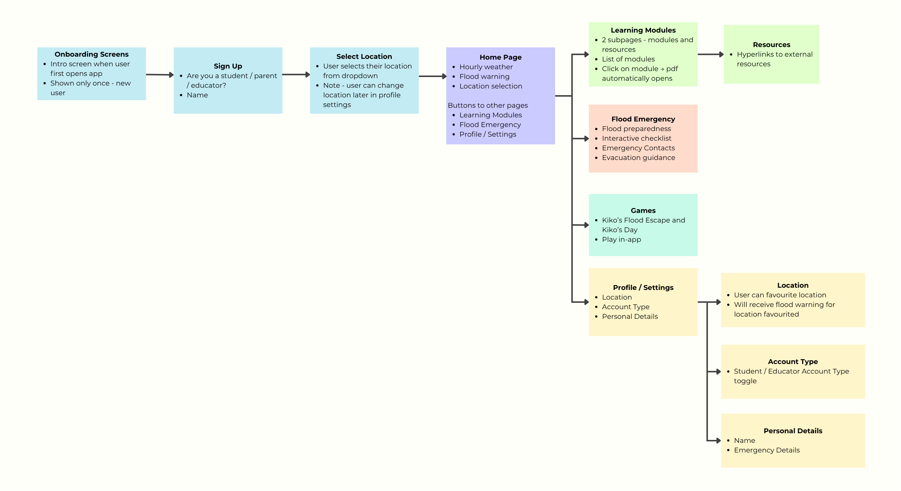

# WASH-Ed-Community-Resilience-Platform

The WASH-Ed Community Resilience Platform is a cross-platform mobile application designed to support Filipino families with children aged 6–12 prepare for flood emergencies while promoting WASH (Water, Sanitation, and Hygiene) education.

The app combines:
- Emegency preparedness resources
- Child-friendly WASH education
- Flood risk warnings

Educational content will feature the Kiko Carabao character and utilise WASH-Ed curriculum materials to teach children hygiene behaviours that are critical during disasters when waterborne diseases increase.

The platform will integrate hazard data from MeteoSource to provide location-based flood warnings for families and preparedness information for families. 

## Table of Contents
- [1. Project Goals](#1-project-goals)
- [2. Target Users](#2-target-users)
  - [2.1 Primary Users](#21-primary-users)
  - [2.2 Secondary Users](#22-secondary-users)
- [3. Features of App](#3-features-of-app)
- [4. Non Functional Requirements](#4-non-functional-requirements)
- [5. Mobile User Interface Workflow](#5-mobile-user-interface-workflow)
- [6. Tech Stack](#6-tech-stack)
- [7. Configuration / Environment Variables](#7-configuration--environment-variables)
- [8. System Prerequisites](#8-system-prerequisites)
- [9. Installation Instructions](#9-installation-instructions)
  - [9.1 Clone the Repository](#91-clone-the-repository)
  - [9.2 Install Flutter Dependencies](#92-install-flutter-dependencies)
  - [9.3 Set up an Emulator](#93-set-up-an-emulator)
  - [9.4 Configure Environment Variables](#94-configure-environment-variables)
  - [9.5 Verify Flutter Setup](#95-verify-flutter-setup)
  - [9.6 Run the App](#96-run-the-app)
- [10. API Integrations](#10-api-integrations)
- [11. Project Structure](#11-project-structure)
- [12. Contributors](#12-contributors)
- [13. Client](#13-client)
- [14. License](#14-license)

## 1. Project Goals
The proposed Minimum Viable Product (MVP) aims to achieve the following outcomes
- Deliver accessible and engaging WASH education for children aged 6–12 and their families
- Provide real-time flood alerts and hazard information through integration with Philippine weather API's
- Support family emergency preparedness via practical tools such as checklists and evacuation guidance
- Create an intuitive, child-friendly user experience leveraging the Kiko Carabao character
- Ensure usability in low-connectivity environments, including offline access to essential content

## 2. Target Users
### 2.1 Primary Users
- Filipino Children aged 6-12
- Parents/guardians and educators in flood-prone communities

### 2.2 Secondary Users
- Community health workers
- Local government units

## 3. Features of App
- Location based flood alerts, and hourly weather
- WASH Education Modules featuring Kiko Carabao
- User account types
- Offline functionality for learning modules
- Flood preparedness checklists and evacuation guidance
- Direct links to official hazard monitoring, and important websites
- Interactive mini games for WASH learning

## 4. Non Functional Requirements
- Fast loading times
- Child-friendly and intuitive interface
- Accessibility for users with low digital literacy
- Low-bandwidth optimisation

## 5. Mobile User Interface Workflow


## 6. Tech Stack
| Layer | Technology | Description |
|-------|------------|-------------|
| Mobile Framework | Flutter (Dart) | Cross-platform app for Android and iOS |
| Database | Firestore | User profiles, squad members, and module progress - syncs across devices |
| Cloud Storage | Firebase Storage | Hosts PDF learning modules - downloaded once and cached on device |
| API | MeteoSource | Weather and flood alert data for location-based warnings |
| API Cache | SQLite | Caches API responses locally within the app for offline and low-bandwidth access |
| UI/UX Design | Figma | Wireframes and UI prototyping |
| Mini Games | Links to itch.io | WASH learning games opened via in-app WebView |
| Version Control | GitHub | Source control and collaboration |
| Project Management | JIRA | Sprint planning and task tracking |

## 7. Configuration / Environment Variables
1. Create a `.env ` file in WASH-Ed-Community-Resilience-Platform\server folder that is an exact copy of the `.env` example
2. Add the Meteosource API key
3. Leave the Google blank

## 8. System Prerequisites
1. [Flutter SDK](https://docs.flutter.dev/install) - includes Dart SDK
2. Integrated Development Environment - e.g. [Visual Studio Code](https://code.visualstudio.com/) with the Flutter extension
3. [Android Studio](https://developer.android.com/studio) - required for Android builds
   - Flutter Android setup guide: [docs.flutter.dev/platform-integration/android/setup](https://docs.flutter.dev/platform-integration/android/setup)
   - Flutter Android Studio guide: [docs.flutter.dev/tools/android-studio](https://docs.flutter.dev/tools/android-studio)
4. [Git](https://git-scm.com/downloads)

## 9. Installation Instructions
### 9.1 Clone the Repository
```
git clone https://github.com/nataliaavu/WASH-Ed-Community-Resilience-Platform
cd wash-ed-community-resilience-platform
```

### 9.2 Install Flutter Dependencies
```
flutter pub get
```

### 9.3 Set Up an Emulator
To run the app you need an Android emulator:
1. Open Android Studio -> Virtual Device Manager
2. Click Create device and follow setup steps
3. Start emulator

### 9.4 Configure Environment Variables
1. Duplicate the `.env.example` file in the project root and rename it to `.env`
2. Fill in your API Keys
3. In the `.env` file, replace `your_meteosource_key_here` with the API key found in WashEd MeteoSource dashboard

### 9.5 Verify Flutter Setup
Run the following command and resolve any issues flagged before continuing
```
flutter doctor
```

### 9.6 Run the App
1. Open two terminals
2. In the first terminal run:
```
cd server
node index.js
```
3. In the second terminal run:
```
flutter run
```

## 10. API Integrations
The app integreates with MeteoSource APIs to deliver location-based flood warnings
| Resource | URL |
| -------- | ------ |
| MeteoSource API Docs | meteosource.com/documentation |
| MeteoSource Dashboard | meteosource.com/client |

## 11. Project Structure
This is a Flutter project targeting Android and iOS
```
wash-ed-community-resilience-platform/
├── android/
│   ├── app/
│   │   ├── src/
│   │   │   ├── debug/
│   │   │   │   └── AndroidManifest.xml
│   │   │   ├── main/
│   │   │   │   ├── kotlin/com/example/wash_ed_app/
│   │   │   │   │   └── MainActivity.kt
│   │   │   │   ├── res/
│   │   │   │   │   ├── drawable/
│   │   │   │   │   ├── drawable-v21/
│   │   │   │   │   ├── mipmap-hdpi/
│   │   │   │   │   ├── mipmap-mdpi/
│   │   │   │   │   ├── mipmap-xhdpi/
│   │   │   │   │   ├── mipmap-xxhdpi/
│   │   │   │   │   ├── mipmap-xxxhdpi/
│   │   │   │   │   ├── values/
│   │   │   │   │   └── values-night/
│   │   │   │   └── AndroidManifest.xml
│   │   │   └── profile/
│   │   │       └── AndroidManifest.xml
│   │   ├── build.gradle.kts
│   │   └── google-services.json
│   ├── gradle/wrapper/
│   │   └── gradle-wrapper.properties
│   ├── build.gradle.kts
│   ├── gradle.properties
│   └── settings.gradle.kts
│
├── assets/
│   ├── kiko/                           # Kiko Carabao character sprites
│   │   ├── WashEd_kiko_sprite_base.png
│   │   ├── WashEd_kiko_sprite_cheer.png
│   │   ├── WashEd_kiko_sprite_sad.png
│   │   ├── WashEd_kiko_sprite_side-jump.png
│   │   ├── WashEd_kiko_sprite_stress.png
│   │   ├── WashEd_kiko_sprite_thumbs-up.png
│   │   ├── washed-carabao_sprite_defeat.png
│   │   ├── washed-kiko_sprite_games-ready-to-play.png
│   │   ├── washed-kiko_sprite_get-started_00_wave-welcome.png
│   │   ├── washed-kiko_sprite_get-started_01_learn-discover.png
│   │   ├── washed-kiko_sprite_get-started_02_stay-safe-realtime-updates.png
│   │   ├── washed-kiko_sprite_get-started_03_get-alerts.png
│   │   ├── washed-kiko_sprite_learn-modules-resources.png
│   │   └── washed-kiko_sprite_whats-your-name.png
│   ├── logos/                          # Sponsor and partner logos
│   │   ├── burger-point.jpeg
│   │   ├── connel-griffin.jpeg
│   │   ├── dep-ed.jpeg
│   │   └── grundfos.jpeg
│   ├── pdfs/                           # WASH education module PDFs
│   │   ├── student/                    # Student-facing modules
│   │   │   ├── MOD-1 - Water Resources and Accessibility - Educator (v2.0).pdf
│   │   │   ├── MOD-2 - Water Safety & Health - Educator (v2.0).pdf
│   │   │   ├── MOD-3 - Water Sustainability - Educator (v2.0).pdf
│   │   │   ├── MOD-4 - Sanitation - Educator (v2.0).pdf
│   │   │   ├── MOD-5 - Hand Hygiene - Educator (v2.0).pdf
│   │   │   └── MOD-6 - Disinfection & Other Hygienic Practices - Educator (v2.0).pdf
│   │   └── teacher/                    # Teacher/facilitator modules
│   │       ├── MOD-1 - Water Resources and Accessibility - Facilitator (v2.0).pdf
│   │       ├── MOD-2 - Water Safety & Health - Facilitator (v2.0).pdf
│   │       ├── MOD-3 - Water Sustainability - Facilitator (v2.0).pdf
│   │       ├── MOD-4 - Sanitation - Facilitator (v2.0).pdf
│   │       ├── MOD-5 - Hand Hygiene - Facilitator (v2.0).pdf
│   │       └── MOD-6 - Disinfection & Other Hygienic Practices - Facilitator (v2.0).pdf
│   ├── wash-ed/                        # WASH-Ed branding and logo assets
│   │   ├── Kiko's Day Mini Games.png
│   │   ├── Kiko's Flood Escape.png
│   │   ├── WASHEd_logo_2022_icon_drop-shadow.png
│   │   ├── WASHEd_logo_2022_icon_no-shadow.png
│   │   ├── WASHEd_logo_2022_og_drop-shadow.png
│   │   ├── WASHEd_logo_2022_og_no-shadow.png
│   │   ├── WASHEd_logo_2022_one-text_drop-shadow.png
│   │   ├── WASHEd_logo_2022_one-text_no-shadow.png
│   │   ├── WASHEd_logo_2022_two-text_drop-shadow.png
│   │   ├── WASHEd_logo_2022_two-text_no-shadow.png
│   │   └── masy-x-washed_badge-samples_v1.png
│   └── UI_Workflow.png
│
├── ios/
│   ├── Flutter/
│   │   ├── AppFrameworkInfo.plist
│   │   ├── Debug.xcconfig
│   │   └── Release.xcconfig
│   ├── Runner.xcodeproj/
│   ├── Runner.xcworkspace/
│   └── Runner/
│       ├── Assets.xcassets/
│       │   ├── AppIcon.appiconset/
│       │   └── LaunchImage.imageset/
│       ├── Base.lproj/
│       │   ├── LaunchScreen.storyboard
│       │   └── Main.storyboard
│       ├── AppDelegate.swift
│       ├── Info.plist
│       ├── Runner-Bridging-Header.h
│       └── SceneDelegate.swift
│
├── lib/                                # Main Flutter/Dart source code
│   ├── config/
│   │   └── app_config.dart             # App-wide configuration
│   ├── controllers/
│   │   └── api_controller.dart         # API request handling
│   ├── data/                           # Data sources and local storage
│   │   ├── app_notifiers.dart
│   │   ├── database_helper.dart        # SQLite database helper
│   │   ├── http_flood_data_source.dart
│   │   ├── http_weather_data_source.dart
│   │   ├── mock_flood_data_source.dart
│   │   ├── philippine_location_coords.dart
│   │   └── philippine_locations.dart
│   ├── models/                         # Data models
│   │   ├── flood_status.dart
│   │   ├── module_model.dart
│   │   ├── squad_member.dart
│   │   ├── user_location.dart
│   │   ├── user_profile.dart
│   │   ├── weather_api.dart
│   │   └── weather_forecast.dart
│   ├── repositories/                   # Data access layer
│   │   ├── firebase_modules_repository.dart
│   │   ├── firebase_user_repository.dart
│   │   ├── flood_repository.dart
│   │   ├── modules_repository.dart
│   │   └── weather_repository.dart
│   ├── views/                          # UI screens
│   │   ├── games/
│   │   │   └── games_page.dart         # Mini-games page
│   │   ├── home/
│   │   │   └── home_page.dart          # Dashboard, weather widget, flood risk
│   │   ├── learn/
│   │   │   └── learn_page.dart         # WASH education modules and resources
│   │   ├── onboarding/
│   │   │   ├── init_page.dart          # App entry / splash
│   │   │   └── onboarding_page.dart    # Welcome carousel screens
│   │   ├── prepare/
│   │   │   └── prepare_page.dart       # Flood guidance, checklists, emergency contacts
│   │   ├── profile/
│   │   │   ├── account_type_page.dart  # Student / Educator / Parent toggle
│   │   │   ├── manage_locations_page.dart
│   │   │   └── personal_details_page.dart
│   │   ├── setup/
│   │   │   ├── setup_location_page.dart
│   │   │   ├── setup_name_page.dart
│   │   │   ├── setup_page.dart
│   │   │   ├── setup_role_page.dart
│   │   │   └── setup_squad_page.dart
│   │   ├── home.dart                   # Bottom nav shell
│   │   └── profile.dart                # Profile screen
│   ├── widgets/                        # Reusable UI components
│   │   ├── flood_widget.dart
│   │   ├── modules_list.dart
│   │   └── weather_widget.dart
│   └── main.dart                       # App entry point
│
├── server/                             # Backend proxy server (Node.js)
│   ├── index.js
│   ├── package.json
│   ├── package-lock.json
│   ├── .env.example
│   └── .gitignore
│
├── test/
│   └── widget_test.dart
│
├── .gitignore
├── .metadata
├── analysis_options.yaml
├── devtools_options.yaml
├── pubspec.lock
├── pubspec.yaml                        # Flutter dependencies and asset declarations
└── README.md
```

## 12. Contributors
| Name | Student ID | Role |
|------|------|------|
| Natalia Vu | 14253987 | Team Lead / Full Stack Developer |
| Alyssa Guerrero | 14287510 | Business Analyst / Front End Developer|
| Bidhan Battachan | 25486022 | Back End Developer / Tester |
| Matt Aducayen | 25483951 | Back End Developer |
| William Lay | 25483342 | Front End Developer |

## 13. Client
Developed in collaboration with: **WASH Education Pty Ltd.**
- Thomas Da Jose
- Arielle Struhl
- Gryan Perez

## 14. License
This project was developed for educational and research purposes in collaboration with WASh-Ed. All educational content and character assets remain the property of WASH Education Pty Ltd.
